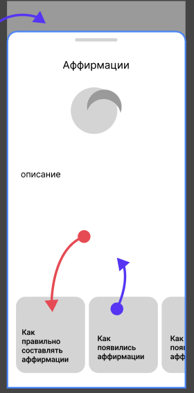
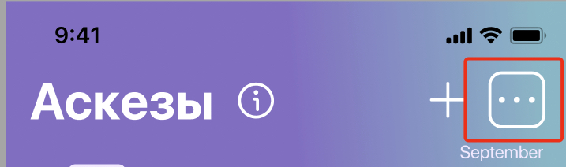

# Техническое задание 
# [Figma](https://www.figma.com/file/wD5sNhAEy078xDp5KVomqN/app?type=design&node-id=245-3903&mode=design&t=Iay8ifRdWAmU1qyf-0)
---

## Глобальные задачи:
- Доработка оставшихся скринов.
- Изменение, дополнение шрифта (возможно).
- Текст на двух языках: RU, EN
- Дизайн иконки приложения во всех размерах.
- Скрины для AppStore (iphone + Ipad) и GooglePlay сторов.
---

## [1] Onboarding
> **Важно**:
> - Минимализм (касаемо текста)
> - Картинки/иллюстрации , анимации.
> - Кнопка для перехода на след шаг.
> - Сколько заголовков, столько и Шагов.
> .

#### Нравится:
  

# Содержимое

Тема | Заголовок |           |
------ |-------------------|------------------
| Календарь| Познайте тайны Луны | Отслеживайте важные даты и события и их воздействие на вашу жизнь! Принимайте верные решения и будьте в контакте с собой!
| Календарь | Вдохновляйтесь ритмами Вселенной | Разгадайте тайны лунного календаря и почувствуйте магию ведических традиций!
| Аффирмации | Начните свой день с позитива |  Пусть каждый день начинается с вдохновения.
| Аскезы |  Примите вызов и укрепите свой дух |  Идите по пути внутреннего развития и трансформируйте свою жизнь через аскезы! Расширьте границы своих возможностей!

***возможно будет еще дополнено***

---

## [2] Аскезы | Добавление новой аскезы | bottomsheet

> **Важно**:
> - Это должен быть bottomsheet 
> - Информация заполняется по шагам.
> - Каждый скрин с шагом должен содержать: 
> -- титульник (наприм: "введите название аскезы")
> -- textfield и или другой механизм ввода информации
> -- кнопку далее (если это последний шаг то кнопка заменяется на "Добавить")
> -- кнопку назад.
> - Отменить флоу заполнения аскезы можно либо закрытием bottomsheet путем свайпа,
> либо по нажатию на крестик (или текст "отменить", это на усмотрение дизайнера).

# Содержимое

| Шаги |           |
|-------------------|------------------
| 0.  | Готовые аскезы / Добавить свою
| 1.  | Введите Название
| 2.  | Опишите вашу цель
| 3 | укажите Дату начала + Дату окончания
| 4 | Сколько раз в неделю вы бы хотели выпонять аскезу ?
| 5 | показывается вся введенная информация и кнопка "Добавить"

> **Описание содержимого**:
> - 0 - на этом шаге юзер делает выбор :
> - 0.1 - юзер тыкнул "готовые аскезы" , в этом bottomsheet ему показываются список готовых аскез. 
> Каждая аскеза содерижт: Название, описание, периодичность выполнения 
> в неделю (ПН ВТ) либо (ВТ ЧТ ПТ) либо (СР).
> Содержимое по списку скинем позже.
> По нажатию на аскезу пользовталея кидает на экран Аскез.
> !!!! Важно: Большинство аскез будут платные , поэтому нужно заблурить или замазать аскезы в бесплатной версии
> - 0.2 - юзер тыкнул на "добавить свою" далее он попадает 
> на шаг 1.
> - 1 - юзер вводит название, на этом скрине должен быть textField,
> Дизайнер должен учесть, что будет открыта клавиатура.
> Пока пользователь не ввел название, кнопка "далее" должна быть неактивной,
>  после ввода она становится активной и юзер может идти на шаг 2
> - 2 - все тоже самое как в шаге 1.
> - 3 - выбор даты начала и конца.
> ВЫБОР даты должен осушествлятся  "Date Picker" (можно посомтреть на картинке ниже)
> То есть на ботомсшите должено отображаться "выберите дату начала" "выберите дату окончания", 
> по нажатию на текст открывается Date Picker 
> там выбираем нужную дату и вместо текста появляется дата.
> После того как пользователь выбрал датну начало и дату окончания
> Кнопка становится активной и юзер идет на шаг 4
> - 4 - на скрине должны отображатся 7 кружков так как в неделе 7 дней.
> (ПН) (ВТ) (СР) (ЧТ) (ПТ) (СБ) (ВС)
> Юзер должен выбрать сколько раз в неделю он хочет выпонять аскезу
> Он нажимает на кружочки, они меняют цвет И по нажатию на кружочек,
> юзеру пишется сколько раз в неделю он это будет повторять.
> Юзер тыкнул на (ПН) у него кружочек (ПН) стал активным ИИИ ТАКЖЕ появился текст  "1 раз в неделю"
> затем он тыкнул на (ЧТ), у него кружочек (ЧТ) стал активным  ИИИ появился текст  "2 раз в неделю"
> - 5 - вывод всей информацией при этом кнопка "сохранить" - активна
> после нажатия флоу заканчивается и юзер попадает на сркни Аскезы
>.

## Date Picker

#### Уже готово: 
 

---
---
## [3] Информация | bottomsheet

> **Важно**:
> - Это должен быть bottomsheet 
> - Дизайн повторяющийся.
> - Должен быть текст на фоне, задача обыграть. 
> - По содержанию , будет Титульник + основной текст.
> - Это инфоблок, который объясняет что такое Аскезы , Аффирмации и тд.
> - bottomsheet с информацией присутствует на экранах "Аффирмации" "Аскезы"

## Иконка вызова

# вайфрейм 

# Содержимое

| Титульник |    Основа       |
|-------------------|------------------
| Аскезы  | текст
| Аффирмации  | текст

***будет позже***

---
---

## [4] Настройки 

> **Важно**:
> - Это боттом сшит (либо же отдельный экран, как гуру скажет)
> - нужно делать с нуля
> - Кнопка вызова находится в правом верхнем углу.
> - Кнопка вызова должна быть на всех главных экрнаах

## Иконка вызова

# Содержимое

| Пункт Настроек |     описание      |
|-------------------|------------------
|  1 Первый день недели  | нужно выбрать с какого дня начинается неделся либо понедельник либо воскресенье
|2  Ваша локация | в этом пункте можно будет выбрать город и часовой пояс, также должен быть флажок "обновлять автоматически" + кнопка определить локацию, по нажатию на которой будет обновлена локация.
| 3 поддержка | по нажатию на эиту кнопку открывается экран почты (натив)
| 4 Восстановить подписку  | стандарт от эпл
|5 инстаграмм иконка  | переход в инсту
|6 кнопка поделится приложением | открытия стандартного ботомсшита

---
---

## [5] Календарь

> **Важно**:
> - читабельный текст 
> - календарь состоит календаря и ленты с инфой. 
Инфа включает в себя блоки информации. 
Задача продумать дизайн блоков информации (некоторые уже готовы).
Содерждание будет позже.

### Уже готово:

---
---

## [6] Subscription screen

> **Важно**:
> - есть наработки в двух варинтах
> - стандартный гайдлайн для экрана подписки

### Наработки

